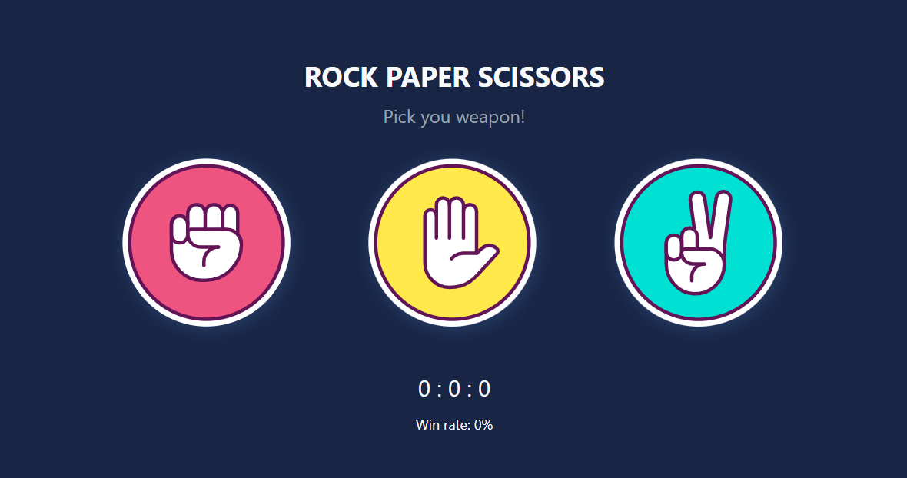

  <h3>Vue.js | Pedra, papel, tesoura</h3>

  

## 💻 Projeto

Projeto desenvolvido em Vue.js. para criar o jogo "Pedra, papel e tesoura". 

## ✨ Linguagens

- HTML;
- CSS;
- Javascript;
- Framework: Vue.js.

## Utilização do projeto

### 💾 Baixar o projeto
Faça o clone do repositório para ter uma versão do projeto em sua máquina: 
`$ git clone https://github.com/mmanaclara/vue-rock-paper-scissors.git`

### 🧰 Instalar dependências
`$ npm install`  

### 🚀 Iniciar o projeto
`$ npm run dev`

